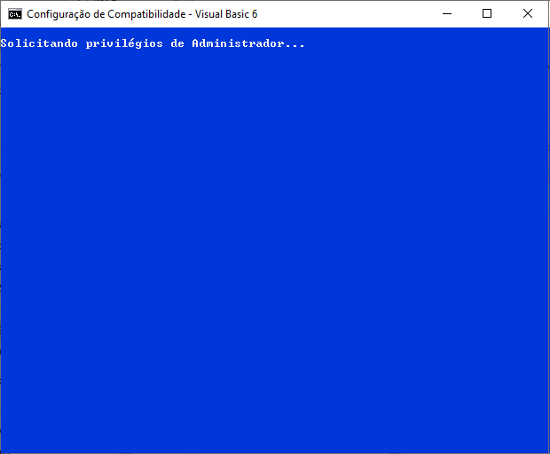
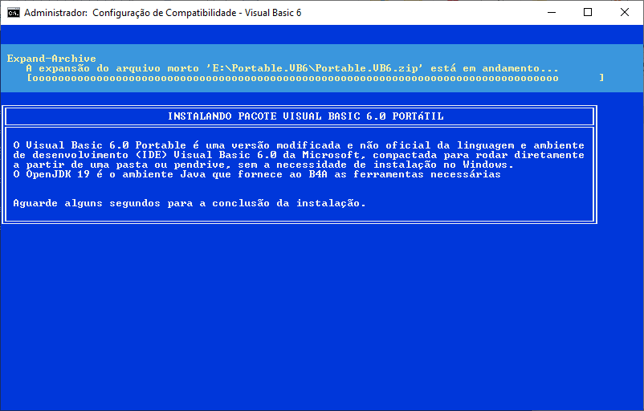
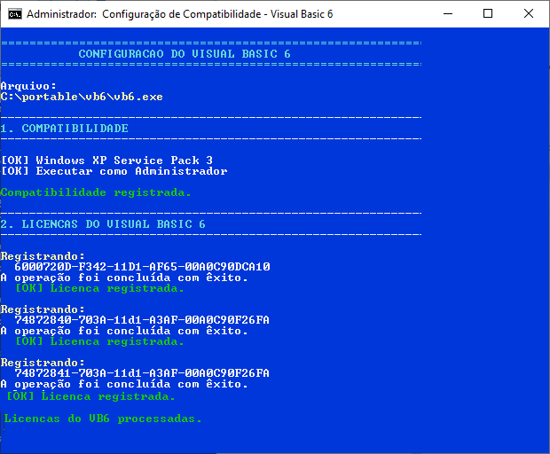
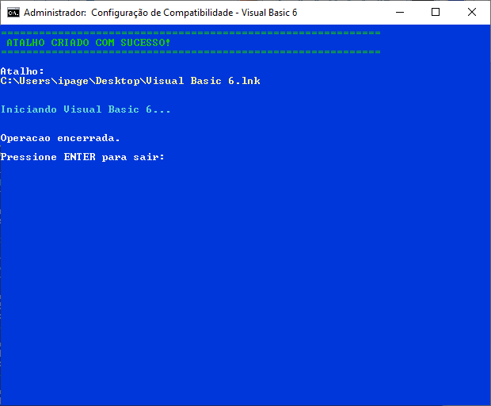
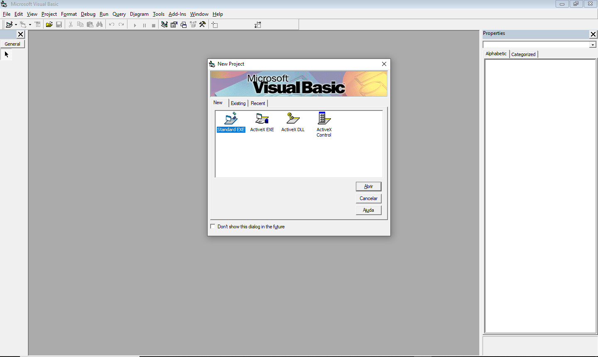
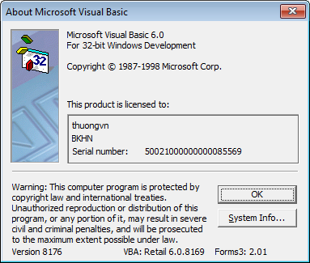
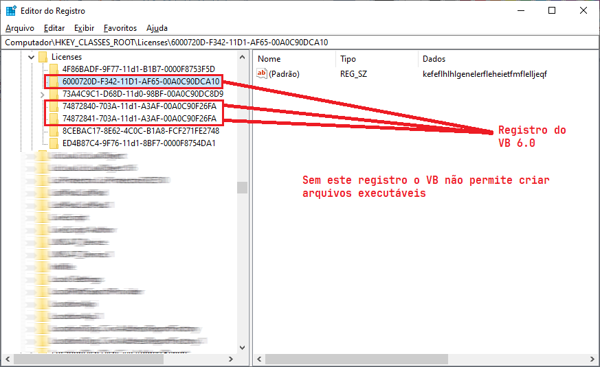
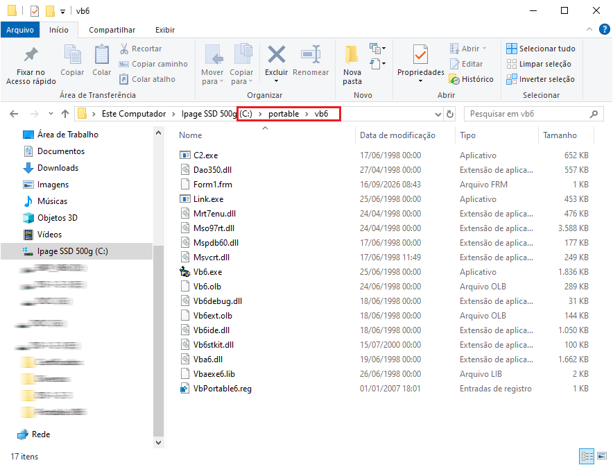

# Visual Basic 6 Portable — Instalação e Configuração Automática
Este projeto fornece uma forma automatizada de preparar e executar uma versão Portable do Microsoft Visual Basic 6.0 no Windows.

A solução utiliza dois scripts:

* `Configurar_VB6.bat`
* `Configurar_VB6.ps1`

O arquivo `.bat` funciona como **instalador/orquestrador**, enquanto o `.ps1` realiza as **configurações específicas do Windows e do Visual Basic 6**.

> **Importante:** o Visual Basic 6.0 Portable utilizado neste projeto é uma versão modificada e não oficial. O projeto não é um instalador oficial da Microsoft e não redistribui uma licença do Visual Basic 6.0.

---

## 📁 Estrutura do projeto

A estrutura esperada é:

```text
VB6-Portable/
│
├── Configurar_VB6.bat
├── Configurar_VB6.ps1
└── Portable.VB6.zip
```

O arquivo `Portable.VB6.zip` deve estar na mesma pasta dos scripts.

Depois da execução, o programa será instalado em:

```text
C:\portable\vb6
```

A estrutura ficará aproximadamente assim:

```text
C:\
└── portable
    └── vb6
        ├── vb6.exe
        ├── ...
        └── ...
```

# 🚀 Como funciona?

O processo possui duas etapas principais.

```text
Configurar_VB6.bat
        │
        ├── Verifica PowerShell
        │
        ├── Verifica Administrador
        │
        ├── Localiza Portable.VB6.zip
        │
        ├── Cria C:\portable\vb6
        │
        ├── Extrai o arquivo ZIP
        │
        └── Executa Configurar_VB6.ps1
                         │
                         ├── Verifica Administrador
                         ├── Localiza vb6.exe
                         ├── Configura compatibilidade
                         ├── Registra configurações/licenças
                         ├── Cria atalho
                         └── Executa o VB6
```

Dessa forma, cada script possui uma responsabilidade específica.

---

# 1. Verificação de administrador

Algumas operações realizadas pelo projeto exigem privilégios administrativos.

A verificação é feita através de:
Se o script não estiver sendo executado como administrador:
ele solicita elevação através do UAC:

O UAC (User Account Control, ou Controle de Conta de Usuário) é um recurso de segurança do Windows que avisa você antes que um programa ou aplicativo tente fazer alterações importantes no computador

Ele faz com que o Windows solicite autorização administrativa.

---

# 🔄 Fluxo completo

O funcionamento pode ser resumido assim:

```text
┌──────────────────────────────┐
│ Configurar_VB6.bat           │
└──────────────┬───────────────┘
               │
               ▼
       Verifica PowerShell
               │
               ▼
      Verifica Administrador
               │
               ▼
     Localiza Portable.VB6.zip
               │
               ▼
     Cria C:\portable\vb6
               │
               ▼
        Extrai arquivos
               │
               ▼
┌──────────────────────────────┐
│ Configurar_VB6.ps1           │
└──────────────┬───────────────┘
               │
               ▼
       Verifica Administrador
               │
               ▼
        Localiza vb6.exe
               │
               ▼
    Configura compatibilidade
               │
               ▼
   Registra configurações VB6
               │
               ▼
       Cria atalho Desktop
               │
               ▼
        Inicia VB6.exe
```

---

# ▶️ Como utilizar

## Método recomendado

Coloque os três arquivos na mesma pasta:

```text
Configurar_VB6.bat
Configurar_VB6.ps1
Portable.VB6.zip
```

Depois execute:

```text
Configurar_VB6.bat
```

O Windows poderá solicitar autorização de administrador.

Clique em:

```text
Sim
```

na janela do UAC.

O instalador irá:

1. verificar o PowerShell;
2. solicitar privilégios administrativos;
3. localizar o arquivo ZIP;
4. criar `C:\portable\vb6`;
5. extrair o Portable VB6;
6. configurar a compatibilidade;
7. registrar as configurações necessárias;
8. criar o atalho no Desktop;
9. iniciar o Visual Basic 6.

---

# 🔐 Requisitos

O ambiente precisa possuir:

* Windows;
* Windows PowerShell;
* privilégios de Administrador;
* `Portable.VB6.zip`;
* `Configurar_VB6.bat`;
* `Configurar_VB6.ps1`.

O espaço necessário em disco depende do conteúdo do pacote Portable.

---

# 📌 Por que utilizar dois scripts?

Separar as funções entre BAT e PowerShell possui algumas vantagens.

## BAT

Responsável por:

* interface inicial;
* configuração do CMD;
* elevação para Administrador;
* localização dos arquivos;
* criação do diretório;
* extração do ZIP;
* chamada do PowerShell.

## PowerShell

Responsável por:

* manipulação do Registro;
* configuração de compatibilidade;
* execução do `reg.exe`;
* tratamento de parâmetros;
* criação do atalho;
* inicialização do VB6.

Essa divisão deixa o projeto mais organizado e facilita futuras modificações.

---

# 🖥️ Resultado esperado

Ao final da operação, deverá existir:

```text
C:\portable\vb6\vb6.exe
```

e um atalho:

```text
Desktop
└── Visual Basic 6.lnk
```

Ao utilizar o atalho, o Windows utilizará as configurações de compatibilidade definidas pelo script.

---

# 🧪 Diagnóstico

Caso algo não funcione, verifique inicialmente:

### VB6 não encontrado

Confirme:

```text
C:\portable\vb6\vb6.exe
```

### ZIP não encontrado

Confirme que:

```text
Portable.VB6.zip
```

está na mesma pasta do:

```text
Configurar_VB6.bat
```

### Erro de permissão

Execute:

```text
Configurar_VB6.bat
```

e permita a elevação de privilégios no UAC.

### PowerShell não encontrado

Verifique se o Windows PowerShell está instalado em:

```text
C:\Windows\System32\WindowsPowerShell\v1.0\
```

---

# 📜 Licenciamento e distribuição

Este projeto de scripts deve ser separado do conteúdo proprietário do Visual Basic 6.0.

Os scripts de automação podem ser disponibilizados conforme a licença escolhida para este repositório, mas a distribuição de arquivos, componentes ou licenças do Microsoft Visual Basic 6.0 deve observar os respectivos direitos e termos aplicáveis.

O projeto não deve ser interpretado como um instalador oficial da Microsoft.

---

# 👨‍💻 Objetivo do projeto

O objetivo é facilitar a preparação de um ambiente portátil para desenvolvimento legado em **Visual Basic 6**, reduzindo a necessidade de realizar manualmente diversas configurações no Windows.

A automação permite transformar várias etapas manuais em um único processo:

```text
ZIP
 ↓
BAT
 ↓
PowerShell
 ↓
Configuração do Windows
 ↓
Atalho
 ↓
VB6
```


## 📌 Resumo dos arquivos

| Arquivo              | Função                      |
| -------------------- | --------------------------- |
| `Configurar_VB6.bat` | Instalador e orquestrador   |
| `Configurar_VB6.ps1` | Configuração do Windows/VB6 |
| `Portable.VB6.zip`   | Pacote do VB6 Portable      |

---

## ✅ Conclusão

A combinação de **Batch + PowerShell** permite criar um processo simples para preparar o Visual Basic 6 Portable.

O Batch cuida da experiência de instalação e da preparação dos arquivos, enquanto o PowerShell executa as tarefas que exigem maior integração com o Windows.

O resultado é um procedimento automatizado que:

* instala o pacote;
* configura a compatibilidade;
* registra as configurações necessárias;
* cria um atalho;
* inicia o Visual Basic 6.

---

## Observação

O VB6 continua sendo utilizado em muitos sistemas legados. Apesar de suas limitações, ele ainda possui uma grande quantidade de aplicações em produção.

Conhecer essas limitações e adotar ferramentas complementares, como Git e sistemas de backup, é uma maneira prática de tornar a manutenção desses projetos mais segura.

---

## 🖼️ Imagens

















---

### ACEITE E RESPONSABILIDADE DO USUÁRIO

Ao executar este instalador, o usuário declara estar ciente
de que o programa poderá realizar alterações no sistema
operacional Windows, criar, modificar ou remover arquivos e
diretórios, instalar componentes e executar processos com
privilégios administrativos.

A utilização deste instalador é realizada por conta e risco
do usuário.

O usuário é responsável por verificar previamente se possui
permissão para instalar, modificar ou remover os componentes
em seu computador.

------------------------------------------------------------------------

## Minhas Redes Sociais

Grupo no WhatsApp de Estudos: ** Código Limpo**
https://chat.whatsapp.com/HtA3mPmmB4RLw7tVJYVvL2

Grupo no WhatsApp da Ipage
https://chat.whatsapp.com/DPcG8meShJQCW3IgJLOYHZ

Grupo no Telegram
https://t.me/+RqTU5VvdkRvFCR36

Linkedin
http://www.linkedin.com/in/diogenes-dias-458a6a50

Instagram
https://www.instagram.com/ipage_software/?igsh=MWluYXhxcXE0cnE2cQ%3D%3D

Youtube
https://www.youtube.com/@Ipagesoftware

---

## Meus Produtos

APi para cálculo de rotas, consulta de CEP, consulta de CNPJ.
https://rapidapi.com/diogenes/api/ipage_cep/details
